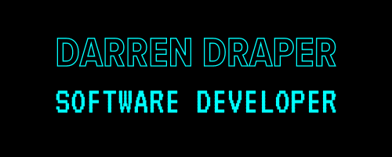
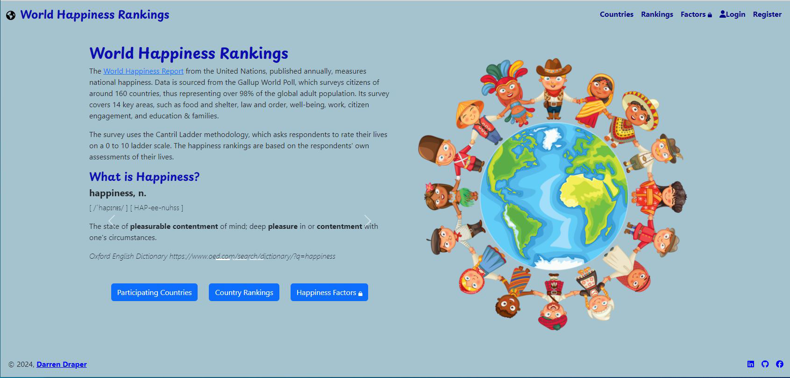

 

### Hi there, I'm Darren 👋

Software Engineer, Web Developer, Full-stack Developer, Tech Enthusiast.

## Tech Stack

## My Latest Project
Happiness App: A React-based web app for viewing and analysing 'happiness survey' data from the World Happiness Report.

 

## GitHub Statistics

<!-- a href="https://www.twitter.com/darren_draper/"></a -->

<!--
**darren-2016/darren-2016** is a ✨ _special_ ✨ repository because its `README.md` (this file) appears on your GitHub profile.

Here are some ideas to get you started:

- 🔭 I’m currently working on ...
- 🌱 I’m currently learning ...
- 👯 I’m looking to collaborate on ...
- 🤔 I’m looking for help with ...
- 💬 Ask me about ...
- 📫 How to reach me: ...
- 😄 Pronouns: ...
- ⚡ Fun fact: ...
-->
